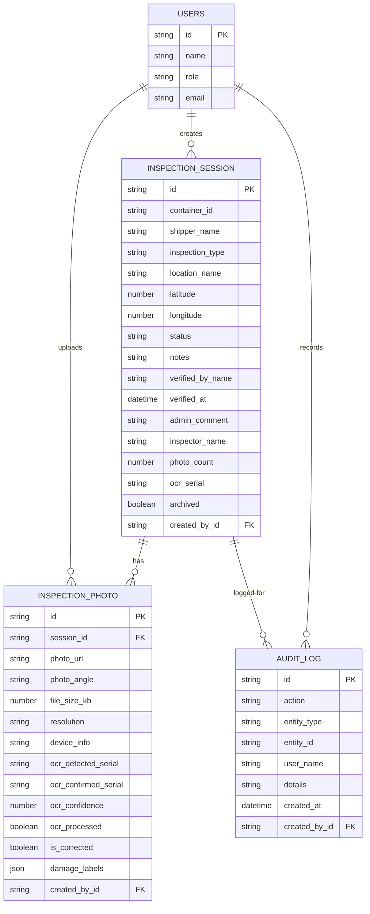

# ERD — Data model overview

This document describes the core data models inferred from the project `entities/` definitions and their relationships.

Notes:
- `InspectionSession` is the central aggregate representing an inspection of a container.
- `InspectionPhoto` stores uploaded photos and OCR/damage metadata and references `InspectionSession` via `session_id`.
- `AuditLog` stores activity events (create/update/delete/verify/export/login/etc.) and references entities via `entity_type` + `entity_id`.
