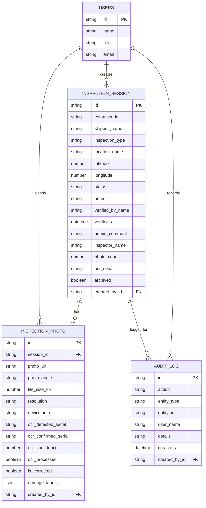
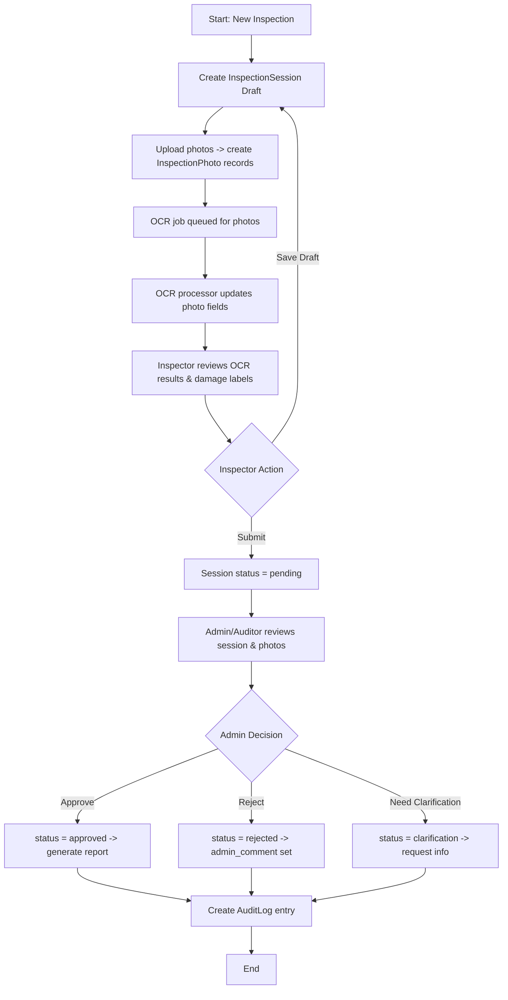

# Kontainer Check 📦🔍

A modern, full-stack **Container Inspection & Damage Tracking System** designed to streamline shipping container audits. The system facilitates photo uploads, automated OCR detection of container serial numbers, damage labeling, status workflow management, and audit logging.

It features a high-performance **React/Vite** frontend powered by Tailwind CSS & Radix UI primitives, coupled with a lightweight **vanilla Node.js** backend powered by a simple JSON file database.

---

## 🚀 Key Features

*   👥 **Role-Based Workflows**: Tailored workspaces for **Inspectors**, **Admins**, **Auditors**, and **Shippers**.
*   🔒 **Secure OTP Authentication**: Sign-up and login secured via 6-digit email OTP codes.
*   📸 **Inspection Photo Uploads**: Upload container images corresponding to different camera angles (Front, Back, Left, Right, Interior, Serial, Other).
*   🤖 **AI-Assisted OCR & Damage Labeling**: Extract container serial numbers and predict damage labels automatically using a backend processing pipeline.
*   🚦 **Lifecycle Verification**: Keep track of inspection sessions through explicit state transitions (`draft` ➔ `pending` ➔ `approved` / `rejected` / `clarification`).
*   📝 **Comprehensive Audit Logs**: Automated historical tracking of actions like creation, upload, submission, verification decisions, and exports.
*   📊 **Analytics & Reporting**: Elegant dashboards visualizing inspection statuses, damage patterns, and historical activity logs.

---

## 🛠️ Tech Stack

### Frontend
- **Framework**: [React](https://react.dev/) + [Vite](https://vite.dev/)
- **State Management / Data Fetching**: [TanStack React Query](https://tanstack.com/query/latest)
- **Styling**: [Tailwind CSS](https://tailwindcss.com/)
- **UI Components**: [Radix UI Primitives](https://www.radix-ui.com/), [Lucide React](https://lucide.dev/), [Sonner](https://github.com/emilkowalski/sonner) (Toasts)
- **Routing**: [React Router DOM](https://reactrouter.com/)
- **Charts**: [Recharts](https://recharts.org/)

### Backend
- **Runtime**: [Node.js](https://nodejs.org/) (ES Modules)
- **Server**: Vanilla Node `http` server (Custom JSON Routing API)
- **Database**: File-based local JSON database (`backend/data/db.json`)
- **Authentication**: Custom session token storage, pbkdf2 password hashing, and Gmail SMTP-based OTP verifier

---

## 🗺️ System Architecture

### Entity Relationship Diagram (ERD)



### Inspection Lifecycle Workflow



---

## ⚙️ Setup & Installation

### Prerequisites
- Node.js (version 18+ recommended)
- npm or yarn

### Configuration

Create a `.env` file in the root directory (you can copy `.env.example` as a starting point):

```env
PORT=8789
HOST=127.0.0.1
APP_ORIGIN=http://127.0.0.1:5173
PUBLIC_BASE_URL=http://127.0.0.1:8789

# OTP Verification Setup (Required for registration)
EMAIL_USER=your-email@gmail.com
EMAIL_PASS=your-16-character-gmail-app-password
```

### Available NPM Scripts

Install dependencies first:
```bash
npm install
```

Run frontend, backend, or both:
```bash
npm run dev_full     # Starts both frontend (Vite) and backend server in parallel
npm run dev          # Starts the Vite React frontend only (http://127.0.0.1:5173)
npm run backend      # Starts the vanilla Node backend server only (http://127.0.0.1:8789)
npm run build        # Builds the React frontend application for production
npm run test:login-load   # Runs login load verification tests
```

---

## 👥 Seed Accounts

The JSON database initializes automatically with four test users (passwords are all `password123`):

*   🛡️ **Admin**: `admin@example.com` — Full verification control and user management.
*   🔍 **Inspector**: `inspector@example.com` — Creating inspections, uploading photos, and editing drafts.
*   📋 **Auditor**: `auditor@example.com` — Read-only access to all dashboards, reports, and logs.
*   🚢 **Shipper**: `shipper@example.com` — Submitting batch inspections and viewing shipper-specific metrics.

---

## 📡 API Reference

Below are the primary backend API routes:

| Method | Endpoint | Description | Role Required |
| :--- | :--- | :--- | :--- |
| **POST** | `/api/apps/auth/register` | Register a new user and trigger OTP | Public |
| **POST** | `/api/apps/auth/verify-otp` | Verify user account via 6-digit OTP | Public |
| **POST** | `/api/apps/auth/login` | Login user and issue session token | Public |
| **GET** | `/api/inspection-sessions` | List inspection sessions | Authenticated |
| **POST** | `/api/inspection-sessions` | Create a new inspection session | `inspector` |
| **GET** | `/api/inspection-sessions/:id` | Fetch specific inspection details | Authenticated (Owner/Admin) |
| **PATCH** | `/api/inspection-sessions/:id` | Update inspection details (drafts) | Owner / `admin` |
| **POST** | `/api/inspection-sessions/:id/submit`| Submit inspection session for review | Owner |
| **POST** | `/api/inspection-sessions/:id/verify`| Approve, reject, or request clarification | `admin` |
| **POST** | `/api/inspection-sessions/:id/photos`| Upload a photo to an inspection session | `inspector` |
| **GET** | `/api/photos/:id` | Fetch photo information | Authenticated (Owner/Admin) |
| **POST** | `/api/photos/:id/ocr` | Rerun or confirm OCR serial numbers | Owner / `admin` |
| **GET** | `/api/audit-logs` | Retrieve system action logs | `admin` / `auditor` |

---

## 📝 Git Integration Notes

To maintain repository cleanliness, the following files and directories are ignored under `.gitignore`:
- `node_modules/` & `dist/`
- `.env` & `.env.local`
- `Memory-bank/` (contains engineering/database model design notes)
- `.agents/` & `agent/`
- `vite-dev.log` & `vite-dev.err.log`
